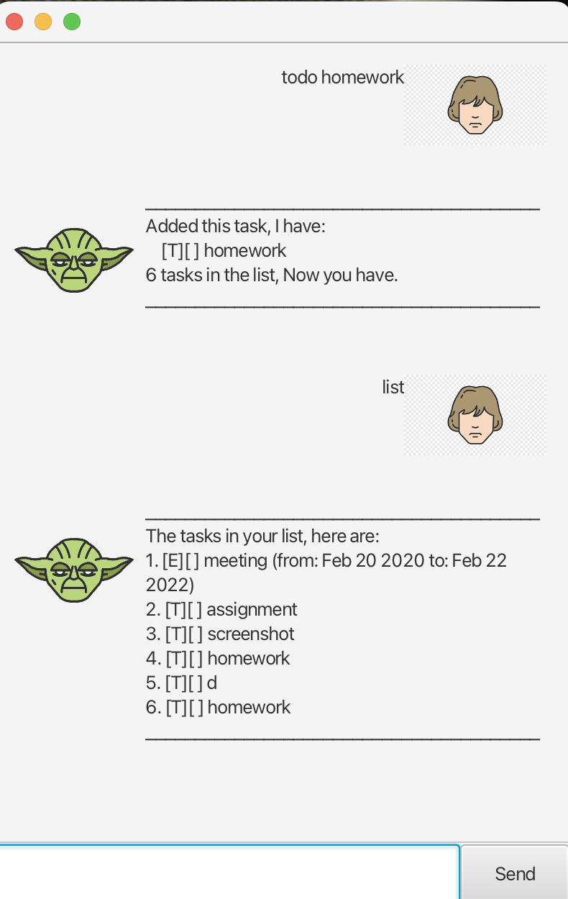

# Yoda User Guide



Yoda is a tiny task manager with a quirky mentor. Add tasks, mark them done, search, 
and save them to disk. Now with a simple GUI: type a command in the input box and press Send (or hit Enter).
Type help anytime to see the built-in help.

## Quick Start
1. Launch the app (double-click the JAR or run java -jar yoda.jar).
2. Type a command, e.g. todo borrow book
3. Manage tasks with list, mark 2, unmark 2, delete 3, find book.
4. Type bye to exit.

## Command Summary

| Command    | Format                                                           | Description                               | Example                                                |
|------------|------------------------------------------------------------------|-------------------------------------------|--------------------------------------------------------|
| `todo`     | `todo <description>`                                             | Add a to-do task                          | `todo read book`                                       |
| `deadline` | `deadline <description> /by <when>`                              | Add a task with a deadline                | `deadline return book /by 2/12/2019 1800`              |
| `event`    | `event <description> /from <start> /to <end>`                    | Add an event with start/end               | `event meeting /from 2019-12-02 14:00 /to 2019-12-02 16:00` |
| `list`     | `list`                                                           | Show all tasks                            | `list`                                                 |
| `mark`     | `mark <n>`                                                       | Mark task *n* as done                     | `mark 2`                                               |
| `unmark`   | `unmark <n>`                                                     | Mark task *n* as not done                 | `unmark 2`                                             |
| `delete`   | `delete <n>`                                                     | Delete task *n*                           | `delete 3`                                             |
| `find`     | `find <keyword>`                                                 | List tasks whose description matches      | `find book`                                            |
| `help`     | `help`                                                           | Show in-app help                          | `help`                                                 |
| `bye`      | `bye`                                                            | Exit the app                              | `bye`                                                  |

> **Note:** Index `<n>` is **1-based** in commands (e.g., `1` is the first task).

### Supported date/time formats

- **Date only:** `2019-12-02`, `2/12/2019`, `2-12-2019`
- **Date & time:** `2019-12-02T18:00`, `2/12/2019 1800`, `2/12/2019 18:00`, `2019-12-02 1800`, `2019-12-02 18:00`


# Feature details

---

### Adding to-dos

Add a task without any date/time.

**Usage**

```todo <description>```

**Example**

```todo read book```

**Expected outcome**

```
________________________________________
Added this task, I have:
[T][ ] read book
1 tasks in the list, Now you have.
________________________________________
```

---

### Adding deadlines

Add a task that has a due date or date-time.

**Usage**
```
deadline <description> /by <when>
```
**Examples**

```
deadline return book /by 2/12/2019 1800

deadline project report /by 2019-12-02
```

**Expected outcome**
```
________________________________________
Added this task, I have:
[D][ ] return book (by: Dec 2 2019, 18:00)
2 tasks in the list, Now you have.
________________________________________
```
---

### Adding events

Add a task with a start and an end.

**Usage**

`event <description> /from <start> /to <end>`

**Example**

`event project meeting /from 2019-12-02 14:00 /to 2019-12-02 16:00`

**Expected outcome**

```
________________________________________
Added this task, I have:
[E][ ] project meeting (from: Dec 2 2019, 14:00 to: Dec 2 2019, 16:00)
3 tasks in the list, Now you have.
________________________________________
```

---

### Listing tasks

Show all tasks with their indices.

**Usage**

`list`

**Expected outcome**

```
________________________________________
The tasks in your list, here are:
1. [T][ ] read book
2. [D][ ] return book (by: Dec 2 2019, 18:00)
3. [E][ ] project meeting (from: Dec 2 2019, 14:00 to: Dec 2 2019, 16:00)
________________________________________
```
---

### Marking a task as done

Mark task n as completed.

**Usage**

`mark <n>`

**Example**

`mark 2`

**Expected outcome**

```
________________________________________
Marked this task as done, I have:
[D][X] return book (by: Dec 2 2019, 18:00)
________________________________________
```
---

### Unmarking a task

Mark task n as not done.

**Usage**

`unmark <n>`

**Example**

`unmark 2`

**Expected outcome**
```
________________________________________
not done yet, is this task:
[D][ ] return book (by: Dec 2 2019, 18:00)
________________________________________
```
---

### Deleting a task

Delete task n from the list.

**Usage**

`delete <n>`

**Example**

`delete 3`

**Expected outcome**
```
________________________________________
Deleted this task, I have:
[E][ ] project meeting (from: Dec 2 2019, 14:00 to: Dec 2 2019, 16:00)
________________________________________
```
---

### Finding tasks

Show tasks whose description contains the given keyword (case-insensitive).

**Usage**

`find <keyword>`

**Example**

`find book`

**Expected outcome**
```
________________________________________
Here are the matching tasks in your list:
1. [T][ ] read book
2. [D][ ] return book (by: Dec 2 2019, 18:00)
________________________________________
```
---

### Help

Open the in-app help page.

**Usage**

`help`

**Expected outcome**
```
 Display the contents of /help/help.txt.
```
---

### Exiting

Close the application.

**Usage**

`bye`

**Expected outcome**

`Farewell, I bid you.`
